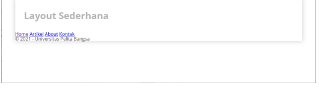

# lab4web4

 Membuat Layout Sederhana 

1. Buat folder baru dengan nama lab4_layout, kemudian buatlah file baru didalamnya dengan nama 
home.html, dan file css dengan nama style.css.

Berikut Hasilnya : 

2. Kemudian tambahkan kode CSS untuk membuat layoutnya.

Berikut Hasilnya : 

3. Kemudian selanjutnya mengatur navigasi.

Berikut Hasilnya : 

4. Selanjutnya membuat hero panel. Tambahkan kode HTML dan CSS seperti berikut.

Berikut Hasilnya : 

5. Selanjutnya mengatur main content dan sidebar, tambahkan CSS float.

Berikut Hasilnya : 

6. Kemudian selanjutnya menambahkan element lain dalam sidebar. 

Berikut Hasilnya : 

7. Selanjutnya mengatur tampilan footer. Tambahkan CSS untuk footer. & Selanjutnya membuat content artikel. Tambahkan HTML berikut pada main content.

Berikut Hasilnya : 

